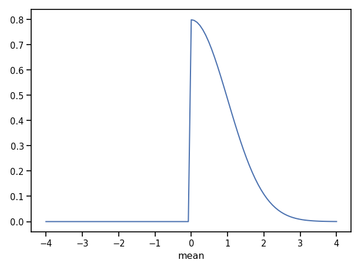
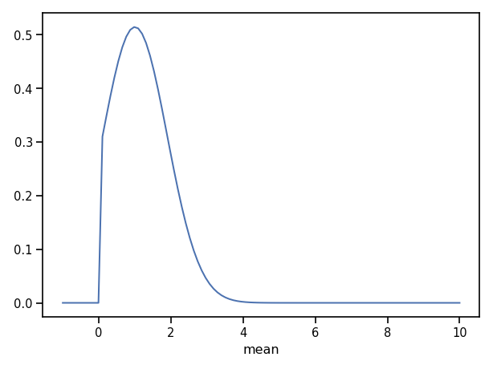
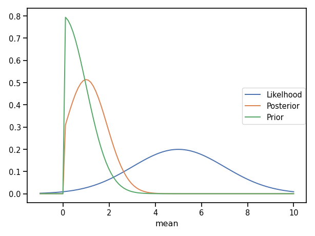

## Installation

**Bayesplay-py** is not yet available on PyPI, but you can grab a
prebuilt wheel from the releases page. You can install it with pip:

``` bash
pip install bayesplay_py-0.2.0-cp311-cp311-macosx_11_0_arm64.whl
```

## Bayesplay-py

**bayespaly-py** is a Python version of the [Bayesplay R
package](https://bayesplay.github.io/bayesplay/index.html). It’s still
in early development, but it contains most of the key functionality of
the **R** package, including all the functionality needed to compute
Bayes factors and posteriors.

To compute a Bayes factor, you just need to put together a *likelihood*
and two *priors*. One for each of the alternative and null hypotheses
[^1].

## Basic usage

To demonstrate how **bayesplay-py** works, we’ll implement a simple
analysis from [Dienes & Mclatchie
(2018)](https://doi.org/10.3758/s13423-017-1266-z).

Dienes & Mclatchie (2018) reanalysed some data from a study by Brandt,
IJzerman, & Blaken (2014). In the study by Brandt et al. (2014), they
obtained a mean difference for 5.5 Watts (t statistic = 0.17, SE =
32.35).

We can describe this observation with a normal likelihood using the
`Likelihood` class. We’ll use the `Likelihood.normal` constructor to
specify the likelihood.

``` python
from bayesplay_py import Likelihood, Prior, Evidence, Model
```

``` python
likelihood = Likelihood.normal(mean=5.5, se=32.35)
```

Following this, Dienes & Mclatchie (2018) describe the two models they
intend to compare. First, the null model is described as a point prior
centred at 0. We can specify this with the `Prior` class and the
`Prior.point` constructor. We’ll set the `point` value to 0.

``` python
h0_prior = Prior.point(point=0)
```

Next, Dienes & Mclatchie (2018) describe the alternative model. For this
they use a half-normal distribution with a mean of 0 and a standard
deviation of 13.3. This can again be specified using the `Prior` class
and the `Prior.normal` constructor. We’ll set the `mean` and `sd` as
required. Additionally, because they specify a half-normal distribution,
we’ll truncate the prior by setting the lower limit of the distribution
(`ll`) to 0.

``` python
h1_prior = Prior.normal(mean=0, sd=13.3, ll=0)
```

With the three parts specified we can compute the Bayes factor. The
first step is to calculate evidence for each model. To do this, we
multiply the likelihood by the prior and integrate.

``` python
# First we specify the models
m1: Model = likelihood * h1_prior
m0: Model = likelihood * h0_prior
```

``` python
# Then we integrate to compute the model evidence
m1_evidence: Evidence = m1.integrate()
m0_evidence: Evidence = m0.integrate()

# Dividing the model evidences compute the evidence of 
# m1 relative to m0. That is, the Bayes factor.
bf = m1_evidence / m0_evidence
print(bf)
```

    0.9745933672782535

This gives a Bayes factor of ~0.97, the same value reported by Dienes &
Mclatchie (2018).

## Implementing Default Bayesian t-Tests

We can also use **Bayesplay-py** to implement a Bayesian t-test like
those that can be done with the **BayesFactor** **R** package.

Let’s first run a couple of analyses with the **R** package to see the
results. We’ll then do the same analyses with **Bayesplay-py**.

First, we’ll generate some data.

``` r
set.seed(12)  # Set a seed for reproducibility
x <- rnorm(n = 100, mean = 3.5, sd = 13)
y <- rnorm(n = 85, mean = 7, sd = 15)
```

Then we can run a one-sample Bayesian t-test using the `ttestBF`
function.

``` r
BayesFactor::ttestBF(x, rscale = 0.707)
```

    Bayes factor analysis
    --------------
    [1] Alt., r=0.707 : 3.869577 ±0.01%

    Against denominator:
      Null, mu = 0 
    ---
    Bayes factor type: BFoneSample, JZS

We can then run a two-sample Bayesian t-test using the same function.

``` r
BayesFactor::ttestBF(x, y, rscale = 0.707)
```

    Bayes factor analysis
    --------------
    [1] Alt., r=0.707 : 0.5415061 ±0.03%

    Against denominator:
      Null, mu1-mu2 = 0 
    ---
    Bayes factor type: BFindepSample, JZS

Now let’s replicate it with **Bayesplay-py**. To do this, we’ll write a
function called `ttestBF`.

``` python
from math import sqrt

import polars as pl
from bayesplay_py import Likelihood, Prior


def ttestBF(x: list[float], y: list[float] | None = None, rscale: float | None = None):
    # We'll work out the mean, sd, and sample size for the first sample.
    x = pl.Series(x)
    mean1 = x.mean()
    sd1 = x.std(1)
    n1 = x.len()

    if y is None:
        # If there is no second sample, then we can just use the
        # noncentral_d likelihood function.
        likelihood = Likelihood.noncentral_d(d=mean1 / sd1, n=n1)
    else:
        # If there is a second sample, then we need to work out the mean, sd,
        # and sample size for it too.

        y = pl.Series(y)
        mean2 = y.mean()
        sd2 = y.std(1)
        n2 = y.len()
        # We then work out the between samples effect size.
        md_diff = mean1 - mean2
        sd_pooled = sqrt((((n1 - 1) * sd1**2) + ((n2 - 1) * sd2**2)) / (n1 + n2 - 2))
        d = md_diff / sd_pooled

        # And use that for the noncentral_d2 likelihood function.

        likelihood = Likelihood.noncentral_d2(d, n1, n2)

    # We use a cauchy distribution for the alternative hypothesis.
    h1_prior = Prior.cauchy(location=0, scale=rscale)

    # And a point prior for the null hypothesis.
    h0_prior = Prior.point(point=0)

    # We then compute the Bayes factor.
    evidence_m1 = (likelihood * h1_prior).integrate()
    evidence_m0 = (likelihood * h0_prior).integrate()
    return evidence_m1 / evidence_m0
```

We can use this to replicate the first **R** analysis[^2].

``` python
print(round(ttestBF(r.x, rscale=0.707), 6))
```

    3.869577

And we get the same result.

We can also use it to replicate the second analysis.

``` python
print(round(ttestBF(r.x, r.y, rscale=0.707), 7))
```

    0.5415061

And again we get the second result.

## Likelihoods, Priors, and Posteriors

**bayesplay-py** also allows you to compute posteriors.

To compute a posterior, we just need to multiply the likelihood and
prior and use the posterior attribute to extract the posterior. For
example, we could use the posterior to compute a Bayes factor using the
Savage-Dickey ratio.

For example, here’s how we would replicate the first analysis using the
Savage-Dickey ratio.

``` python
likelihood = Likelihood.normal(mean=5.5, se=32.35)

prior = Prior.normal(mean = 0, sd = 13.3, ll = 0)

posterior = (likelihood * prior).posterior

# Compute the Savage-Dickey ratio

# we can  just pass 0 to the prior and posterior objects to compute the value
# of the prior at 0 and the value of # the posterior at 0.

bf = prior(0) / posterior(0)

print(bf)
```

    0.9745933672782535

The likelhood, prior, and posterior objects can also be used to draw
plots. If we pass a list of values to each of these we’ll get a list of
outputs, so there’s no need to hand roll a loop to do this.

``` python
import seaborn.objects as so
from seaborn import axes_style

so.Plot.config.theme.update(axes_style())


def seq(start: float, end: float, steps: int) -> list[float]:
    return [start + (i * abs(start - end) / (steps - 1)) for i in range(steps)]


likelihood = Likelihood.normal(mean=0, se=1)
x = seq(-4, 4, 101)
y = likelihood(x)
data = pl.DataFrame({"x": x, "y": y})
plot = (
    so.Plot(data, x=x, y=y)
    .add(so.Line())
    .label(x="mean", y="", color="")
    .theme(axes_style())
)
```

We can do the same for a prior function.

``` python
prior = Prior.normal(mean=0, sd=1, ll=0)
x = seq(-4, 4, 101)
y = prior(x)
(
    so.Plot(data, x=x, y=y)
    .add(so.Line())
    .label(x="mean", y="", color="")
    .theme(axes_style())
).show()
```



Or we can even plot posterior.

``` python
# First we define a likelihood
likelihood = Likelihood.normal(mean=5, se=2)

# Then we define a prior
prior = Prior.normal(mean=0, sd=1, ll=0)


# Multiply the prior and likelihood and use to `posterior` attribute to extract
# the posteior

posterior = (likelihood * prior).posterior

x = seq(-1, 10, 101)
y = posterior(x)
data = pl.DataFrame({"x": x, "y": y})
(
    so.Plot(data, x=x, y=y)
    .add(so.Line())
    .label(x="mean", y="", color="")
    .theme(axes_style())
).show()
```



Or we can put it all together.

``` python
data = pl.concat([
pl.DataFrame({"x": x, "y": likelihood(x), "plot": "Likelhood"}),
pl.DataFrame({"x": x, "y": posterior(x), "plot": "Posterior"}),
pl.DataFrame({"x": x, "y": prior(x), "plot": "Prior"})])
( so.Plot(data, x="x", y="y", color="plot")
  .add(so.Line())
  .label(x="mean", y="", color="")
  .theme(axes_style())
).show()
```



[^1]: For more information about Bayes factors, check out the
    [documentation for the R
    package](https://bayesplay.github.io/bayesplay/index.html) or the
    [course notes](https://bayescourse.netlify.app/) for my old Bayesian
    statistics course.

[^2]: I used quarto to generate this readme, so I can pass data between
    R and Python
